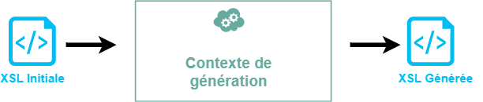

Statut des variables
====================

Trois types de statut pour les variables.  
Le premier pouvant être cumulé avec l'un des deux autres.

## Variables utilisées pendant la génération

* Construction : **statique**
* évaluation : dans le **contexte de génération**
* utilisation : dans le **contexte de génération**

Syntaxe : `<generate:use-variable (...)`  
Resultat généré : aucun  
Proposition : *USED*

## Variables construites pendant la génération

* Construction : pendant la **génération**
* évaluation : lors de **l'éxécution** de la XSL générée
* utilisation : lors de **l'éxécution** de la XSL générée

Syntaxe : `<generate:variable (...) select="concat('count(','//',$foo)" />`  
Résultat généré : `<xsl:variable name="nb" select="count(//toto)" />`  
Proposition : *GENERATED*

## Variables construites et évaluées pendant la génération
* Construction : pendant la **génération**
* évaluation : pendant la **génération**
* utilisation : lors de **l'éxécution** de la XSL générée

Syntaxe : `<generate:variable evaluate="yes" select="concat('count(','//',$foo)" />`  
Résultat généré : `<xsl:variable name="nb">12</xsl:variable> (...)`  
Proposition : *EVALUATED*

